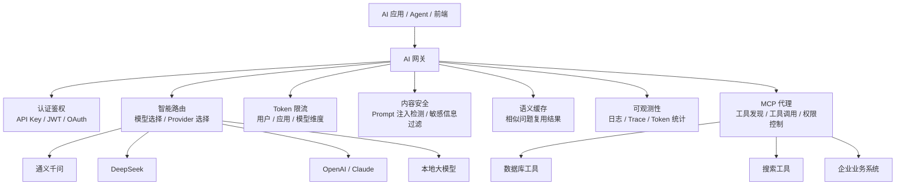
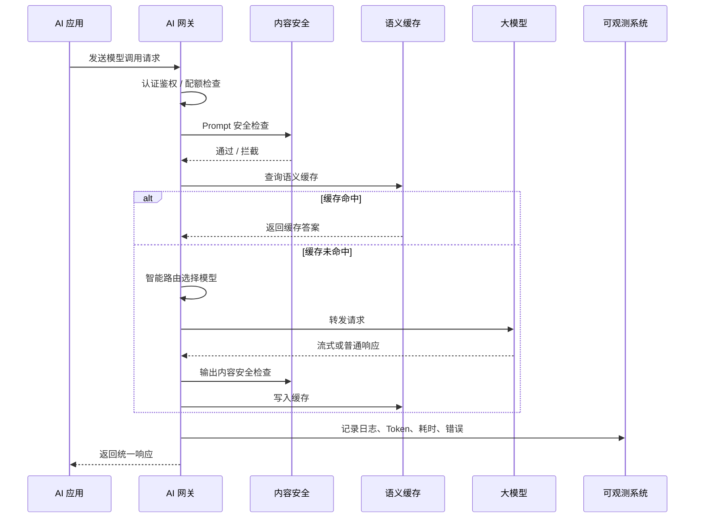

# AI 网关介绍：应用场景、核心能力与技术实现

## 1. 为什么会出现 AI 网关

在传统互联网架构里，网关最早只是一个“请求转发器”：客户端请求先进网关，网关再把请求转给后端服务。

随着架构不断演进，网关也经历了几个阶段：

```text
流量网关 → ESB 网关 → 微服务网关 → 云原生网关 → AI 网关
```

可以简单理解为：

| 阶段 | 主要解决的问题 | 常见代表 |
|---|---|---|
| 流量网关 | 请求转发、负载均衡、高可用 | Nginx |
| ESB 网关 | 企业系统集成、协议转换、消息路由 | 企业服务总线 |
| 微服务网关 | 服务路由、鉴权、限流、熔断 | Spring Cloud Gateway |
| 云原生网关 | Kubernetes 流量入口、弹性伸缩、服务治理 | Ingress / Gateway API |
| AI 网关 | 多模型代理、Token 管控、内容安全、MCP/Agent 管理 | Higress AI Gateway 等 |

AI 网关不是凭空出现的，它是网关在 AI 原生应用时代的自然演进。

传统 API 网关主要管理 HTTP 请求；AI 网关要管理的是大模型、Agent、MCP 工具、Token、流式响应、安全审查和多模型调度。

## 2. 什么是 AI 网关

AI 网关可以理解为：

> AI 应用访问大模型、工具和 Agent 能力时的统一入口。

如果没有 AI 网关，每个应用都要自己处理：

- 调不同模型厂商的 API。
- 保存不同模型的 API Key。
- 做 Token 限流和成本统计。
- 处理模型超时、失败、降级。
- 过滤敏感内容和危险提示词。
- 记录每次模型调用日志。
- 接入 MCP 工具和 Agent 服务。

这些能力如果散落在每个业务系统里，会导致重复开发、难以治理、成本失控和安全风险。

AI 网关的作用就是把这些通用能力集中起来，变成一层统一的 AI 基础设施。

## 3. AI 应用的流量有什么特殊性

AI 网关之所以不同于普通 API 网关，是因为 AI 应用的流量特征发生了变化。

### 3.1 高延时

普通 Web 接口通常几十毫秒到几百毫秒返回；大模型推理可能需要几秒甚至几十秒。

原因：

- 模型推理计算量大。
- 输出内容长。
- 上下文越长，推理越慢。
- 多轮对话需要携带历史消息。

这意味着网关要能处理长时间连接、超时控制和慢请求保护。

### 3.2 大带宽与流式传输

AI 应用经常使用流式输出，例如 ChatGPT 一样逐字返回。

常见协议：

- SSE：Server-Sent Events，适合服务端持续向客户端推送文本。
- WebSocket：适合双向实时通信。
- Streamable HTTP：适合 MCP 等新型流式交互。

传统网关如果只按普通请求响应模式处理，容易出现连接中断、缓冲异常、响应变慢等问题。

### 3.3 长连接

AI 对话、Agent 执行、MCP 工具调用经常需要保持长连接。

例如：

- 用户和 AI 进行多轮聊天。
- Agent 一边思考一边调用工具。
- 服务端不断返回推理中间状态。

网关必须支持稳定的长连接管理，否则用户会看到“对话中断”“生成失败”“任务丢失”等问题。

### 3.4 API 驱动

AI 原生应用通常由大量 API 拼装出来：

- 模型 API。
- Embedding API。
- Rerank API。
- 工具 API。
- MCP Server API。
- Agent API。
- 业务系统 API。

所以 AI 网关不仅要转发请求，还要统一管理这些 API 的认证、路由、审计、限流和观测。

## 4. AI 网关整体架构

下面是一张面向教学的简化架构图：



这张图可以这样理解：

- 应用不直接访问模型，而是先访问 AI 网关。
- AI 网关判断请求来自谁、能不能调用、该调用哪个模型。
- 网关可以在请求前做安全检查，在请求后做结果过滤。
- 网关统一记录 Token 消耗、延迟、错误、模型命中情况。
- 如果应用需要调用工具，AI 网关也可以作为 MCP 工具入口。

## 5. AI 网关的典型应用场景

### 5.1 模型服务提供商的接入层

如果企业要对外提供模型服务，AI 网关可以作为第一道入口。

它负责：

- 接收外部开发者请求。
- 做 API Key 认证。
- 做租户隔离。
- 做 Token 限流。
- 做模型负载均衡。
- 做日志统计和计费。

适合场景：

- MaaS 平台。
- 模型开放平台。
- 企业内部大模型服务平台。

### 5.2 AI 应用开发网关

很多 AI 应用开发者不会自己训练模型，而是同时接入多个模型厂商。

例如：

```text
普通问题 → 便宜模型
复杂推理 → 高性能模型
图片理解 → 多模态模型
模型失败 → 切换备用模型
```

AI 网关可以屏蔽不同模型 API 的差异，给应用提供统一调用方式。

好处：

- 应用代码不用关心不同模型厂商接口差异。
- 可以根据成本、速度、质量动态选择模型。
- 某个模型不可用时，可以自动降级到备用模型。

### 5.3 企业内部中央 AI 网关

大型企业不同部门都会接入 AI 能力，如果没有统一入口，很容易出现：

- 每个部门都私自申请 API Key。
- 成本无法统计。
- 敏感数据可能被发给外部模型。
- 模型调用权限混乱。
- 审计日志不完整。

中央 AI 网关可以像“AI 时代的企业服务总线”：

- 统一接入模型。
- 统一认证鉴权。
- 统一内容安全策略。
- 统一 Token 统计。
- 统一成本分摊。
- 统一审计日志。

### 5.4 MCP 工具生态的统一入口

随着 Agent 应用增多，AI 不只是聊天，还会调用工具：

- 查询数据库。
- 搜索网页。
- 查询订单。
- 调用企业系统。
- 操作文件。
- 调用 Git、飞书、CRM、ERP 等工具。

如果每个 MCP Server 都单独暴露，会有很多问题：

- 权限难管。
- 安全策略重复建设。
- 工具发现混乱。
- 调用日志难统一。
- 限流和审计难做。

AI 网关可以作为 MCP 工具的统一入口：

```text
Agent → AI 网关 → MCP Server → 企业工具 / 外部工具
```

这样可以把认证、授权、限流、审计、安全检查统一放在网关层。

### 5.5 AI 开放平台

当企业希望把内部 AI 能力产品化，对内外开发者开放时，AI 网关可以成为开放平台的底座。

开放平台通常需要：

- 开发者注册。
- API Key 管理。
- 模型服务订阅。
- MCP 工具市场。
- Agent 注册与发现。
- 调用量统计。
- 成本计费。
- 权限审批。
- 文档和示例。

AI 网关提供底层调用、治理和观测能力，上层平台负责管理界面和开发者体验。

## 6. AI 网关的核心能力

### 6.1 多模型代理

多模型代理是 AI 网关最基础的能力。

它把多个模型厂商包装成统一接口：

```text
应用调用统一 API
→ AI 网关识别模型配置
→ 转换成对应厂商请求格式
→ 调用目标模型
→ 转换成统一响应格式
```

典型价值：

- 一个接口接入多个模型。
- 降低模型切换成本。
- 支持模型灰度和迁移。
- 支持国产模型、国外模型、本地模型统一管理。

### 6.2 智能路由与模型选择

AI 网关可以根据规则选择模型：

| 选择依据 | 示例 |
|---|---|
| 成本 | 简单问题走便宜模型 |
| 性能 | 实时对话走低延迟模型 |
| 能力 | 代码生成走代码模型 |
| 合规 | 敏感数据走私有化模型 |
| 可用性 | 主模型故障时切换备用模型 |

例如：

```text
法律问题 → 法律领域模型
图片理解 → 多模态模型
普通聊天 → 通用低成本模型
模型超时 → fallback 到备用模型
```

### 6.3 消费者认证

AI 网关要知道“是谁在调用模型”。

常见方式：

- API Key。
- JWT。
- OAuth2。
- 企业内部账号。
- ConsumerId。

认证之后才能做：

- 权限控制。
- 调用配额。
- 成本统计。
- 审计追踪。
- 租户隔离。

### 6.4 Token 限流

普通 API 常按 QPS 限流，大模型更需要按 Token 限流。

原因是大模型成本通常和 Token 数量强相关：

```text
输入 Token + 输出 Token = 本次调用成本基础
```

AI 网关可以按不同维度限流：

- 用户维度。
- 应用维度。
- 部门维度。
- 模型维度。
- 租户维度。

例如：

```text
部门 A 每天最多 100 万 Token
用户 B 每分钟最多 2 万 Token
应用 C 只能调用低成本模型
```

### 6.5 内容安全防护

AI 应用有一些传统 Web 应用没有的新风险：

- Prompt 注入。
- 越权提问。
- 敏感信息泄露。
- 违规内容生成。
- 恶意诱导模型绕过规则。
- 工具调用误操作。

AI 网关可以在两个阶段做防护：

```text
请求进入模型前：检查输入 Prompt
模型返回结果后：检查输出内容
```

典型场景：

- 金融：防止输出不合规投资建议。
- 医疗：防止泄露患者隐私。
- 政务：防止生成不当政策解释。
- 电商：防止生成虚假宣传文案。
- 企业内部：防止敏感数据被发送给外部模型。

### 6.6 语义缓存

语义缓存不是简单按照字符串完全相等缓存，而是判断“问题意思是否相近”。

例如：

```text
问题 A：如何重置密码？
问题 B：忘记密码怎么找回？
```

这两个问题表达不同，但语义很接近，可以复用缓存结果。

语义缓存的价值：

- 减少模型调用次数。
- 降低成本。
- 提高响应速度。
- 提升高频问答场景体验。

适合场景：

- 客服常见问题。
- 企业内部 FAQ。
- 法律条文解释。
- 教育知识问答。
- 文档摘要复用。

### 6.7 多模型容灾

大模型服务可能出现：

- 超时。
- 限流。
- 返回质量不稳定。
- 服务不可用。
- 上游模型升级导致效果波动。

AI 网关可以做 fallback：

```text
主模型失败 → 备用模型
高质量模型失败 → 通用模型
外部模型失败 → 私有化模型
```

这样可以保证业务连续性。

### 6.8 可观测性

AI 网关需要记录每次调用的关键指标：

- 请求来源。
- 调用模型。
- 请求耗时。
- 输入 Token。
- 输出 Token。
- 总 Token。
- 是否命中缓存。
- 是否触发限流。
- 是否触发安全拦截。
- 错误率。

这些数据可以帮助企业回答：

- 哪个部门用得最多？
- 哪个模型成本最高？
- 哪个应用错误率最高？
- 哪些请求触发了安全风险？
- 哪些问题可以通过缓存优化？

### 6.9 MCP 代理与工具治理

AI 网关可以代理 MCP Server，并提供统一治理能力：

- MCP Server 注册。
- 工具发现。
- 工具调用鉴权。
- 工具调用限流。
- 工具调用日志。
- REST API 转 MCP。
- SSE 转 Streamable HTTP。
- 工具动态路由。

这样 Agent 调用工具时，不需要直接连接所有工具服务，而是统一经过 AI 网关。

### 6.10 工具智能路由

当系统里有大量工具时，Agent 不一定知道应该调用哪个工具。

AI 网关可以结合 Query 改写、Rerank 模型、工具元数据，帮助选择最合适的工具。

例如：

```text
用户问：帮我查一下 ORD-001 的物流
→ AI 网关识别需要订单/物流工具
→ 路由到订单 MCP Server
→ 返回物流状态
```

## 7. 技术实现方式

### 7.1 请求处理流程

一个 AI 网关处理请求的大致流程如下：



### 7.2 统一模型 API

不同模型厂商的 API 格式可能不同，AI 网关可以统一成 OpenAI 兼容格式。

应用只需要调用：

```http
POST /v1/chat/completions
Authorization: Bearer <api-key>
```

网关内部再根据配置转发到：

- 通义千问。
- DeepSeek。
- OpenAI。
- Claude。
- Gemini。
- 本地大模型。

这样业务系统不需要关心底层模型差异。

### 7.3 配置示例：模型路由

教学理解版配置如下：

```yaml
providers:
  qwen:
    type: qwen
    api_key: ${QWEN_API_KEY}
    models:
      gpt-3.5-turbo: qwen-turbo
      gpt-4: qwen-max

  deepseek:
    type: deepseek
    api_key: ${DEEPSEEK_API_KEY}
    models:
      deepseek-chat: deepseek-chat

routes:
  - path: /v1/chat/completions
    strategy: cost_first
    fallback:
      - qwen
      - deepseek
```

这段配置表达的是：

- 应用访问统一的 `/v1/chat/completions`。
- 网关优先选择低成本模型。
- 主模型失败后 fallback 到备用模型。

### 7.4 Token 限流实现思路

Token 限流可以用 Redis 计数器实现。

简化逻辑：

```text
1. 请求进入网关。
2. 解析 ConsumerId / API Key。
3. 估算输入 Token。
4. 查询 Redis 中今日已用 Token。
5. 如果超额，直接拒绝。
6. 如果未超额，放行请求。
7. 模型返回后统计输出 Token。
8. 写回 Redis，更新总 Token。
```

伪代码：

```python
def check_token_limit(consumer_id, input_tokens):
    used = redis.get(f"token:{consumer_id}:today") or 0
    quota = get_quota(consumer_id)

    if used + input_tokens > quota:
        raise Exception("Token 配额已超限")

    redis.incrby(f"token:{consumer_id}:today", input_tokens)
```

### 7.5 语义缓存实现思路

语义缓存通常需要 Embedding 模型和向量数据库。

流程：

```text
用户问题
→ 生成 Embedding
→ 在缓存向量库里查相似问题
→ 相似度超过阈值，直接返回缓存答案
→ 否则调用大模型，并把问题和答案写入缓存
```

适合缓存的问题：

- 重复 FAQ。
- 常见客服问题。
- 固定知识问答。
- 成本较高的长文总结。

不适合缓存的问题：

- 强实时问题。
- 涉及个人隐私的问题。
- 每次答案都必须不同的问题。

### 7.6 内容安全实现思路

内容安全可以分为输入检查和输出检查。

输入检查：

- 是否包含敏感信息。
- 是否包含 Prompt 注入。
- 是否诱导模型绕过规则。
- 是否请求越权数据。

输出检查：

- 是否包含违规内容。
- 是否泄露隐私数据。
- 是否生成不当建议。
- 是否包含危险操作指令。

实现方式：

- 规则库。
- 关键词黑名单。
- 分类模型。
- 专用内容安全 API。
- LLM 自检。

### 7.7 MCP 代理实现思路

MCP 代理可以让 Agent 不直接访问工具，而是统一访问 AI 网关。

```text
Agent
→ AI 网关
→ MCP Server Registry
→ MCP Server
→ 企业系统 / 外部工具
```

网关可以做：

- 工具注册发现。
- 工具权限校验。
- 工具调用审计。
- 工具限流。
- 协议转换。
- 工具结果过滤。

## 8. AI 网关和 API 网关、Model Gateway 的区别

| 类型 | 主要管理对象 | 重点能力 |
|---|---|---|
| API 网关 | 普通 HTTP / RPC API | 路由、鉴权、限流、负载均衡 |
| Model Gateway | 大模型服务 | 多模型代理、模型路由、模型 fallback |
| AI 网关 | AI 应用、模型、Agent、MCP 工具 | 模型治理、Token 管控、内容安全、语义缓存、工具治理、可观测 |

可以这样理解：

```text
API 网关：管普通接口
Model Gateway：管模型接口
AI 网关：管 AI 应用完整调用链
```

很多时候 Model Gateway 是 AI 网关的一部分。

## 9. 一个 AI 应用接入 AI 网关的例子

假设我们要做一个企业知识库问答系统：

```text
用户提问：公司的报销流程是什么？
```

没有 AI 网关时：

```text
应用自己管理 API Key
应用自己调用模型
应用自己做限流
应用自己统计 Token
应用自己做内容安全
应用自己处理模型失败
```

有 AI 网关后：

```text
用户提问
→ 应用请求 AI 网关
→ 网关认证用户身份
→ 网关检查 Token 配额
→ 网关检查 Prompt 是否安全
→ 网关查询语义缓存
→ 网关选择合适模型
→ 网关调用模型
→ 网关过滤输出内容
→ 网关记录日志和 Token 成本
→ 应用拿到答案
```

这样业务应用只需要专注自己的业务逻辑，通用的 AI 治理能力由网关统一负责。

## 10. 教学小结

AI 网关可以用一句话总结：

> AI 网关是 AI 应用访问模型、Agent 和工具的统一入口，负责把模型调用变得安全、可控、可观测、可治理。

它解决的核心问题包括：

- 多模型如何统一接入。
- API Key 如何统一管理。
- Token 成本如何统计和控制。
- 模型失败如何自动切换。
- 敏感内容如何过滤。
- 高频问题如何缓存。
- MCP 工具如何统一治理。
- Agent 调用链如何可观测。

对于企业来说，AI 网关不是“锦上添花”的组件，而是当 AI 应用从 Demo 走向生产时非常关键的基础设施。

## 11. 课堂练习

### 练习 1：判断是否需要 AI 网关

请判断下面场景是否需要 AI 网关，并说明原因：

1. 一个个人 Demo，只调用一个模型做聊天。
2. 一个企业客服系统，同时接入多个模型和订单查询工具。
3. 一个公司内部知识库，所有部门都能调用大模型。
4. 一个 Agent 平台，需要调用多个 MCP 工具。

### 练习 2：设计 AI 网关能力清单

假设你要给医院做一个 AI 问诊助手，请设计 AI 网关至少需要哪些能力。

参考方向：

- 用户认证。
- Token 限流。
- 内容安全。
- 模型选择。
- 日志审计。
- 敏感信息保护。
- 模型 fallback。

### 练习 3：画出调用链

请画出下面流程的架构图：

```text
用户 → AI 应用 → AI 网关 → 内容安全 → RAG 检索 → 大模型 → 输出安全 → 用户
```

并说明每一层负责什么。
