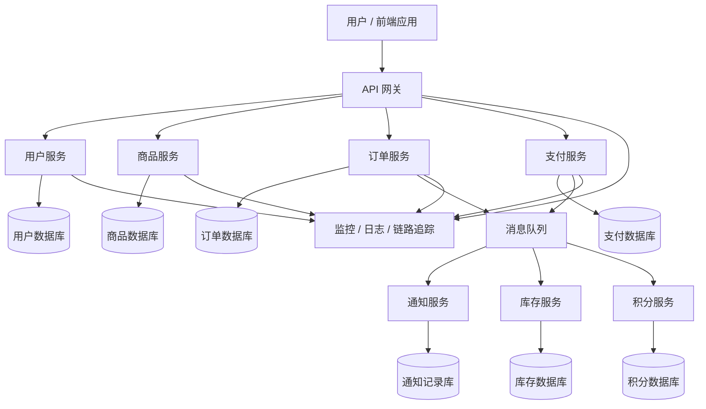
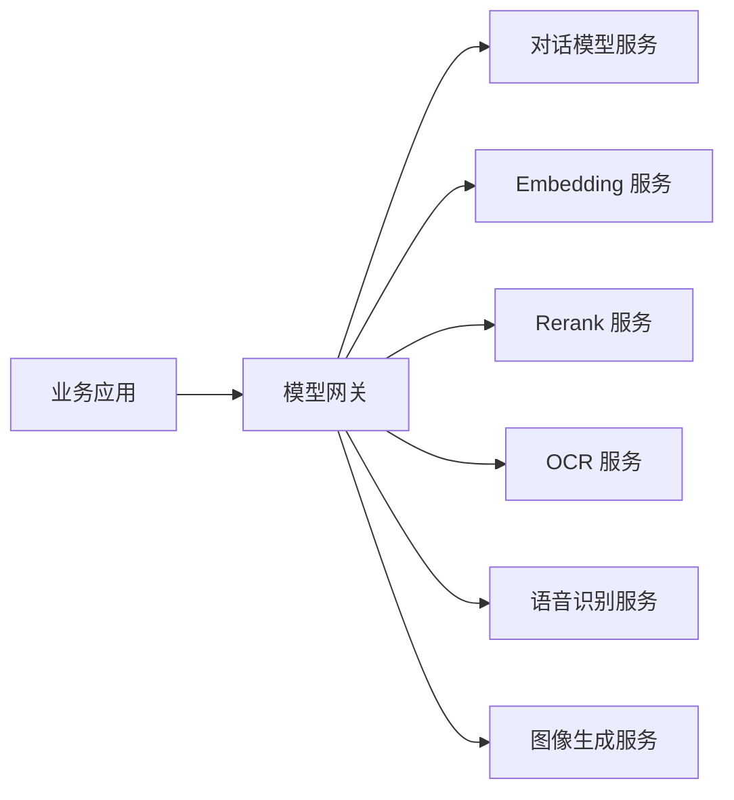
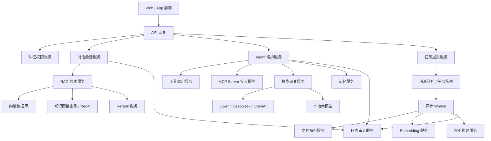

# 微服务架构设计思想与 AI 大模型应用场景

## 1. 什么是微服务架构

微服务架构是一种把大型系统拆分成多个小型服务的架构方式。每个服务围绕一个明确的业务能力独立开发、独立部署、独立扩容，并通过 HTTP API、RPC、消息队列等方式进行通信。

可以把一个电商系统想象成一家公司：

- 用户服务：负责用户注册、登录、权限。
- 商品服务：负责商品信息、库存展示。
- 订单服务：负责下单、订单状态。
- 支付服务：负责支付、退款。
- 消息服务：负责短信、邮件、站内通知。

在单体架构中，这些功能通常放在一个大项目里；在微服务架构中，它们会被拆成多个独立服务。

## 2. 微服务架构的核心设计思想

### 2.1 按业务能力拆分

微服务不是按技术层拆分，例如 Controller、Service、DAO，而是按业务能力拆分。

错误拆法：

```text
用户 Controller 服务
用户 Service 服务
用户 DAO 服务
```

更合理的拆法：

```text
用户服务
订单服务
支付服务
库存服务
推荐服务
```

核心原则是：一个服务负责一个相对完整的业务能力。

### 2.2 服务自治

每个微服务应该尽量独立：

- 独立代码仓库或独立模块。
- 独立数据库或独立数据表边界。
- 独立部署。
- 独立扩容。
- 独立故障隔离。

比如订单服务压力很大时，只需要扩容订单服务，而不用扩容整个系统。

### 2.3 通过接口通信

微服务之间不应该直接读写彼此的数据库，而应该通过清晰的接口通信。

常见通信方式：

- REST API：简单、通用，适合大多数业务接口。
- gRPC：性能较高，适合服务间高频调用。
- 消息队列：适合异步解耦，例如下单后发送短信、扣减库存、生成积分。
- 事件流：适合日志、用户行为、实时数据分析。

### 2.4 数据边界清晰

微服务架构中，一个重要原则是“谁拥有数据，谁负责修改数据”。

例如：

- 用户服务拥有用户数据。
- 订单服务拥有订单数据。
- 支付服务拥有支付流水。
- 库存服务拥有库存数据。

其他服务如果需要数据，应该通过 API 查询，或者通过事件同步必要的信息。

### 2.5 故障隔离

微服务架构要接受一个现实：服务之间会失败。

所以需要设计：

- 超时控制。
- 重试机制。
- 熔断降级。
- 限流。
- 服务监控。
- 链路追踪。

比如推荐服务挂了，不能影响用户下单；可以临时降级为“热门商品推荐”。

## 3. 微服务架构图

下面是一个典型微服务系统的简化架构图：



图中几个关键角色：

- API 网关：统一入口，负责鉴权、路由、限流、日志。
- 业务服务：每个服务负责一个业务能力。
- 独立数据库：每个服务管理自己的数据。
- 消息队列：用于异步解耦，提高系统可靠性。
- 监控系统：用于排查问题和观察系统状态。

## 4. 微服务架构的优势

### 4.1 易于扩展

不同服务可以按需扩容。

例如：

- 秒杀时扩容商品服务、订单服务、库存服务。
- 日常只保留较少支付服务实例。
- AI 推理服务可以单独部署到 GPU 节点。

### 4.2 易于独立迭代

不同团队可以负责不同服务。

例如：

- 用户团队维护用户服务。
- 交易团队维护订单和支付服务。
- AI 团队维护推荐服务和问答服务。

只要接口稳定，各团队可以独立开发和发布。

### 4.3 故障影响范围小

单个服务出问题，不一定拖垮整个系统。

例如：

- 推荐服务不可用，用户仍然可以搜索商品。
- 短信服务不可用，订单仍然可以创建。
- 积分服务延迟，支付流程仍然可以完成。

### 4.4 技术选型更灵活

不同服务可以选择不同技术栈。

例如：

- 订单服务用 Java。
- AI 推理服务用 Python。
- 实时日志服务用 Go。
- 向量检索服务用 Milvus。
- 知识图谱服务用 Neo4j。

### 4.5 更适合云原生部署

微服务天然适合 Docker、Kubernetes、服务发现、弹性伸缩等云原生技术。

## 5. 微服务架构的挑战

微服务不是银弹，它会带来新的复杂度：

- 服务数量变多，部署复杂度上升。
- 服务之间调用链变长，排查问题更难。
- 分布式事务更复杂。
- 数据一致性更难保证。
- 需要完善的监控、日志、链路追踪。
- 团队协作和接口治理要求更高。

所以，微服务适合中大型系统。小项目、早期项目不一定需要一开始就拆成微服务。

## 6. 微服务架构 vs 集中式架构

集中式架构也常被称为单体架构，所有功能通常放在一个应用中统一开发、部署和运行。

| 对比项 | 集中式架构 / 单体架构 | 微服务架构 |
|---|---|---|
| 代码结构 | 一个大项目 | 多个小服务 |
| 部署方式 | 整体部署 | 每个服务独立部署 |
| 数据管理 | 通常共享一个数据库 | 每个服务拥有自己的数据边界 |
| 扩容方式 | 整体扩容 | 按服务单独扩容 |
| 开发效率 | 小项目更快 | 大团队更容易并行 |
| 故障影响 | 一个模块故障可能影响整体 | 故障可隔离在局部服务 |
| 技术选型 | 通常统一技术栈 | 不同服务可用不同技术 |
| 运维复杂度 | 较低 | 较高 |
| 适用阶段 | 初创项目、小系统、教学 Demo | 中大型系统、多团队协作、高并发场景 |

简单理解：

- 单体架构像“一整栋楼”：结构简单，但改造和扩容不灵活。
- 微服务架构像“一个园区里的多栋楼”：每栋楼独立建设，但需要道路、门禁、监控和调度系统。

## 7. 在 AI 大模型应用开发中的应用场景

AI 大模型应用通常包含模型调用、向量检索、知识库、工具调用、任务队列、权限管理、日志监控等多个模块，非常适合用微服务思想拆分。

### 7.1 智能客服系统

可以拆分为：

```text
用户会话服务
意图识别服务
RAG 检索服务
订单查询服务
大模型回复服务
人工客服转接服务
对话日志服务
```

调用流程示例：

```text
用户提问
→ 会话服务接收消息
→ 意图识别服务判断问题类型
→ RAG 检索服务查询知识库
→ 订单服务查询订单状态
→ 大模型服务生成回答
→ 会话服务返回给用户
```

好处：

- RAG 检索服务可以单独优化。
- 大模型服务可以单独接入不同模型。
- 订单服务仍然复用企业已有系统。
- 日志服务可以独立做质检和分析。

### 7.2 企业知识库问答系统

可以拆分为：

```text
文档上传服务
文档解析服务
文本切片服务
Embedding 服务
向量数据库服务
知识图谱服务
RAG 问答服务
权限服务
```

典型流程：

```text
上传 PDF / Word
→ 文档解析
→ 文本切片
→ 生成 Embedding
→ 写入向量库
→ 用户提问
→ 检索相关内容
→ 大模型生成答案
```

如果结合 GraphRAG，还可以增加 Neo4j 知识图谱服务：

```text
向量检索找到相关文档片段
→ Neo4j 查询相关实体和关系
→ 合并文本上下文和图谱上下文
→ 大模型生成更可靠的答案
```

### 7.3 AI Agent 平台

一个 Agent 平台通常包含多个能力模块：

```text
Agent 编排服务
工具注册服务
MCP Server 服务
长期记忆服务
任务队列服务
模型网关服务
审计日志服务
权限控制服务
```

适合微服务化的原因：

- 工具调用和模型调用可能非常耗时，需要异步任务。
- 不同 Agent 可能由不同团队维护。
- 模型网关可以统一管理 OpenAI、Qwen、DeepSeek、本地模型。
- MCP Server 可以作为独立服务接入企业系统。

### 7.4 多模型推理平台

如果系统同时使用多个模型，例如：

- 通用对话模型。
- Embedding 模型。
- Rerank 模型。
- OCR 模型。
- 语音识别模型。
- 图像生成模型。

可以拆分为多个模型服务，并通过模型网关统一访问。



好处：

- 每类模型可以独立部署和扩容。
- GPU 资源可以按服务分配。
- 模型升级不会影响所有业务。
- 可以统一做限流、计费、日志、审计。

### 7.5 异步 AI 任务处理

很多 AI 任务不适合在 Web 请求中同步完成，例如：

- 批量总结文档。
- 批量生成题库。
- 批量分析简历。
- 批量生成图片。
- 长视频转写。
- 大规模知识库重建索引。

这类任务可以拆成：

```text
任务提交服务
任务队列服务
Worker 执行服务
结果存储服务
通知服务
```

这和 Celery、Redis、RabbitMQ、Kafka 等任务队列或消息系统可以结合使用。

## 8. AI 应用中的推荐微服务拆分示例

下面是一个 RAG + Agent 平台的微服务拆分示例：



这个架构中：

- API 网关负责统一入口。
- Agent 编排服务负责思考和流程控制。
- RAG 检索服务负责查知识。
- 模型网关负责统一访问不同大模型。
- 任务队列负责处理耗时任务。
- Neo4j 适合做知识图谱和 GraphRAG。
- 向量数据库适合做语义检索。
- 日志审计服务负责安全、质检和问题追踪。

## 9. 总结

微服务架构的核心不是“把系统拆得越碎越好”，而是围绕业务能力拆分，让系统更容易扩展、部署和维护。

对于 AI 大模型应用来说，微服务架构特别适合以下场景：

- 多模型统一接入。
- RAG 检索链路拆分。
- Agent 工具调用平台。
- 企业知识库系统。
- 异步 AI 任务处理。
- 多团队协作开发。

但如果项目还很小，建议先用模块化单体架构，把边界设计清楚；等业务复杂度、团队规模、并发压力上来后，再逐步演进为微服务架构。
